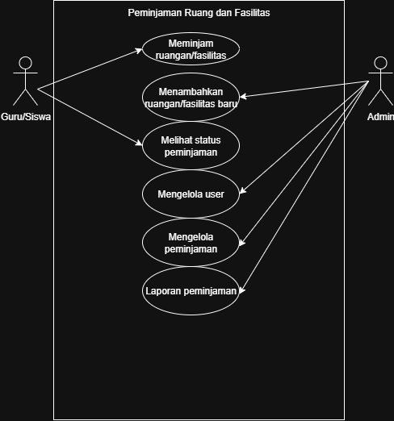
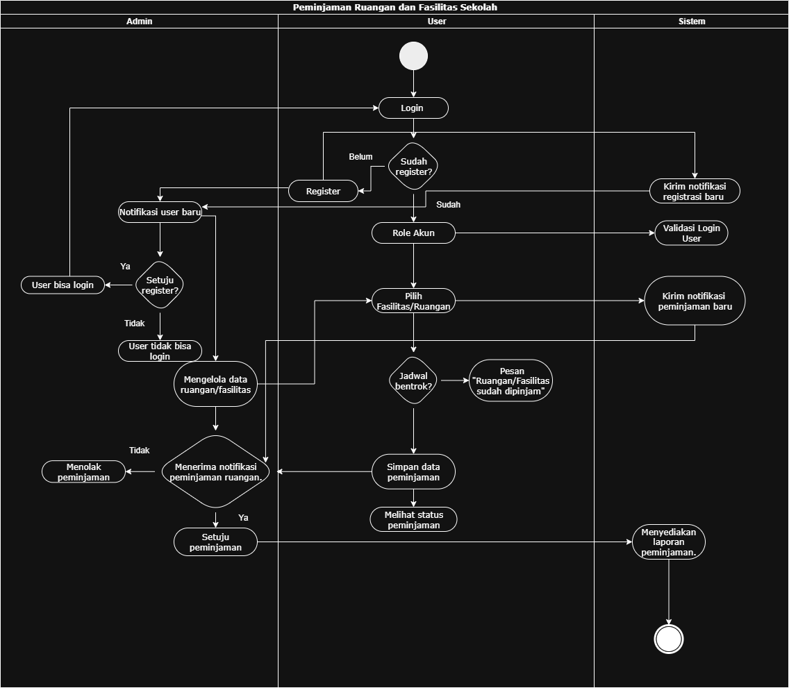
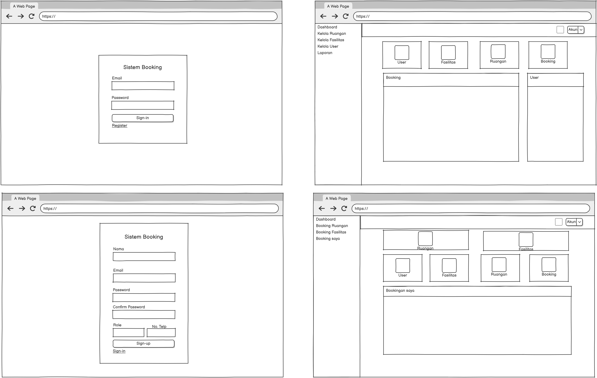

<h1 align="center">📚 Aplikasi Peminjaman Fasilitas / Ruangan Sekolah</h1>

<p align="center">
Aplikasi berbasis web untuk mengelola peminjaman <b>fasilitas</b> atau <b>ruangan</b> sekolah secara online.<br>
Mendukung <b>role user</b>: Siswa, Guru, dan Admin.
</p>

---

## 🚀 Fitur
- Peminjaman fasilitas/ruangan secara online
- Validasi otomatis untuk mencegah konflik jadwal
- CRUD data barang/fasilitas
- Export data ke Excel / PowerPoint
- Status ruangan/fasilitas real-time (terpinjam atau tidak)
- Manajemen persetujuan peminjaman oleh Admin

---

## 👥 Role Pengguna
### 🔹 Siswa & Guru
- Login ke sistem
- Melakukan peminjaman ruangan/fasilitas
- Memasukkan tanggal & durasi peminjaman
- Melihat status peminjaman (proses/disetujui/ditolak)
- Melihat riwayat peminjaman pribadi
- Mengedit atau membatalkan peminjaman

### 🔹 Admin
- Login ke sistem
- Menambah & mengedit data ruangan/fasilitas
- Melihat semua permintaan peminjaman
- Menyetujui atau menolak permintaan peminjaman
- Mengekspor data peminjaman ke Excel / PowerPoint

---

## 📊 Use Case Diagram
📌 File: `docs/usecase.png`  


---

## 🔄 Activity Diagram
📌 File: `docs/activity.png`  


---

## 🧭 Flowchart
📌 File: `docs/flowchart.png`  


---

## 🖼️ Tampilan (Wireframe)
📌 File: `docs/wireframe.png`  


---

## 🗄️ Diagram Basis Data
```mermaid
erDiagram
    USERS {
        int id
        string name
        string email
        string password
        string role
        datetime created_at
    }

    ADMINS {
        int id
        string name
        string email
        string password
        datetime created_at
    }

    FACILITIES {
        int id
        string name
        string description
        string type
        int capacity
        datetime created_at
    }

    RUANGAN {
        int id
        string name
        string description
        string type
        int capacity
        datetime created_at
    }

    BOOKINGS {
        int id
        int user_id
        int facility_id
        int ruangan_id
        date booking_date
        time start_time
        time end_time
        string status
        datetime created_at
    }

    PENYETUJUAN_BOOKING {
        int id
        int booking_id
        int admin_id
        datetime waktu_penyetujuan
        string status
        string notes
    }

    USERS ||--o{ BOOKINGS : membuat
    FACILITIES ||--o{ BOOKINGS : digunakan
    RUANGAN ||--o{ BOOKINGS : digunakan
    ADMINS ||--o{ PENYETUJUAN_BOOKING : memproses
    BOOKINGS ||--o{ PENYETUJUAN_BOOKING : disetujui_atau_ditolak
