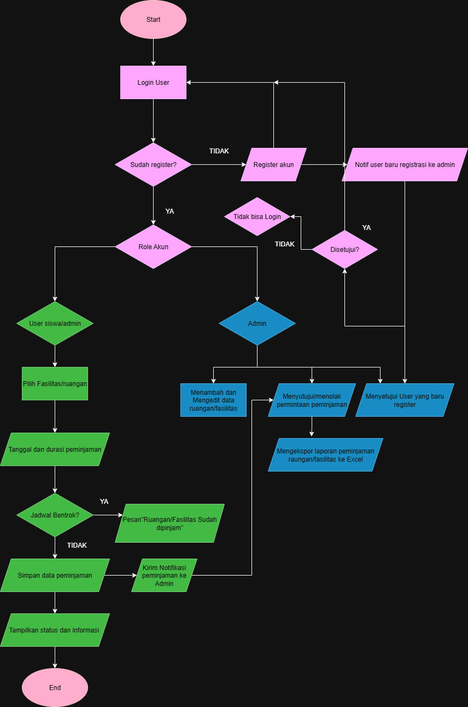

# 📚 Aplikasi Peminjaman Fasilitas / Ruangan Sekolah

Aplikasi berbasis web untuk mengelola peminjaman **fasilitas** atau **ruangan** sekolah secara online.  
Mendukung **role user**: Siswa, Guru, dan Admin.  

---

## 🚀 Fitur
- Peminjaman fasilitas/ruangan secara online
- Validasi otomatis untuk mencegah konflik jadwal
- CRUD data barang/fasilitas
- Export data ke Excel / PowerPoint
- Status ruangan/fasilitas real-time (terpinjam atau tidak)
- Manajemen persetujuan peminjaman oleh Admin

---

## 👥 Role Pengguna
### 🔹 Siswa & Guru
- Login ke sistem
- Melakukan peminjaman ruangan/fasilitas
- Memasukkan tanggal & durasi peminjaman
- Melihat status peminjaman (proses/disetujui/ditolak)
- Melihat riwayat peminjaman pribadi
- Mengedit atau membatalkan peminjaman

### 🔹 Admin
- Login ke sistem
- Menambah & mengedit data ruangan/fasilitas
- Melihat semua permintaan peminjaman
- Menyetujui atau menolak permintaan peminjaman
- Mengekspor data peminjaman ke Excel / PowerPoint

---
## 📊 Use Case Diagram
📌 File: `docs/usecase.png`  

---

## 🔄 Activity Diagram
📌 File: `docs/activity.png`  

---

## 🧭 Flowchart
📌 File: `docs/flowchart.png`  

---

## 🖼️ Wireframe
📌 File: `docs/wireframe.png`  

---

## 🗄️ ERD (Entity Relationship Diagram)
📌 File: `docs/erd.png`  

